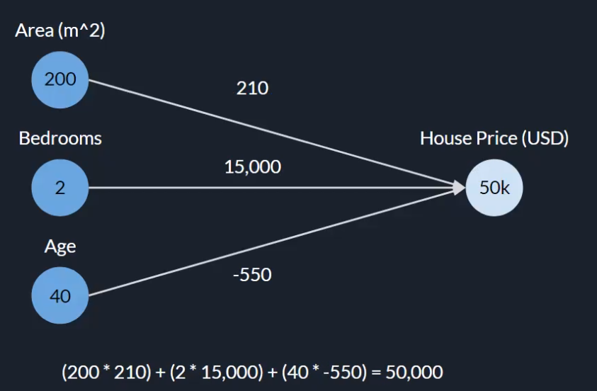
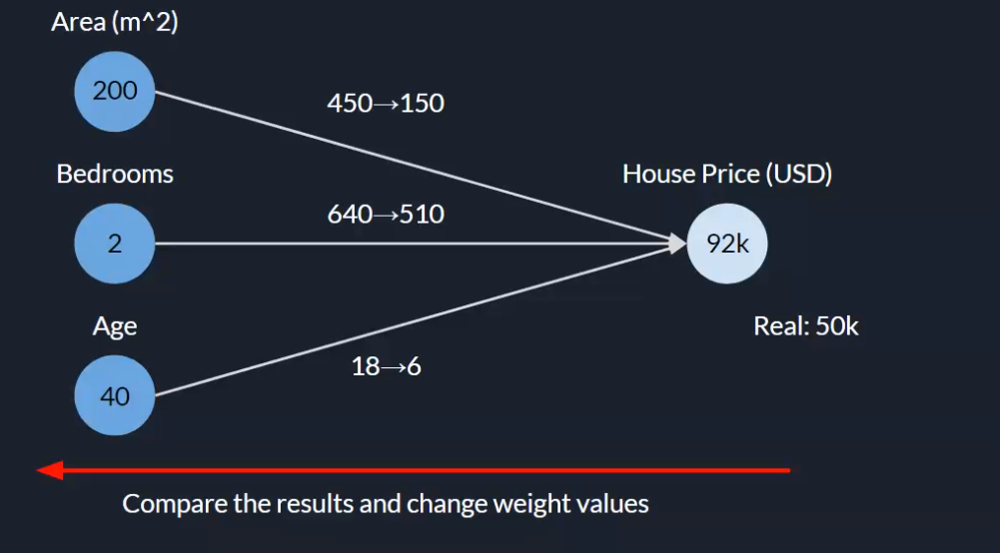

# Deep Learning

* Artificial inteligence: Técnicas que permiten a las maquinas parecerse a humanos.
* Machine learning: Metodos estadisticos que permiten a un algoritmo mejorar a lo largo del tiempo.
* Deep Learning: Un tipo de algoritmos que usan redes neuronales como muchas capas. 

Dataset
: Conjunto de los datos con los que contamos para entrenar el algoritmo.

## k-Nearest neighbor

## Red neuronal simple

### Backward pass

Ajusta los valores de la red mientras se ajusta para acercarse mas al valor adecuado. Se modifican los pesos sumando una cantidad aleatoria.

